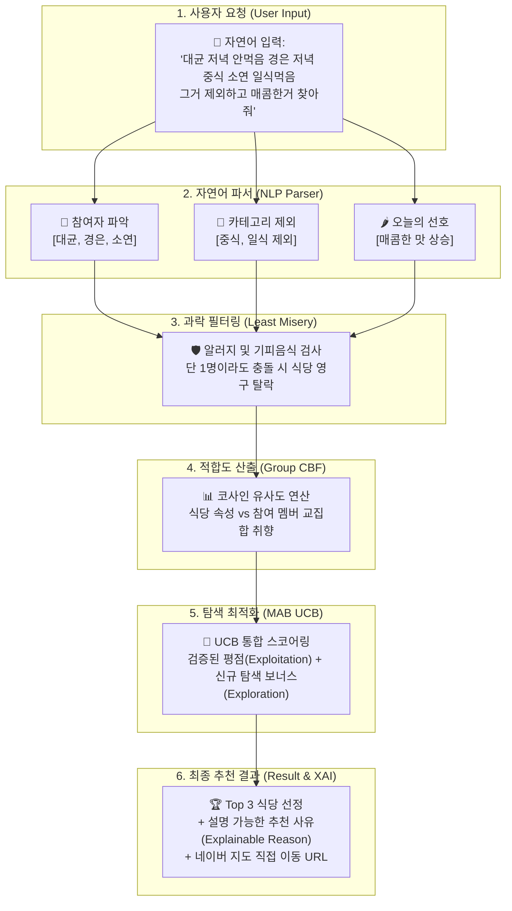

# 🍱 사내 점심 추천 AI 시스템 (Lunch Recommender AI)
## — 비개발자(PM·PO·서비스 기획자·디자이너)를 위한 포트폴리오 완벽 가이드

> **문서 목적:** 본 문서는 비개발자(서비스 기획자, 프로덕트 매니저/오너, UI·UX 디자이너, 마케터 등)가 **사내 점심 맛집 추천 AI 프로젝트**의 작동 원리와 기획 의도를 완벽히 이해하고, 본인의 **포트폴리오·이력서·자기소개서·면접**에 전문적이고 설득력 있게 활용할 수 있도록 작성된 상세 안내서입니다.

---

## 📋 목차 (Table of Contents)

1. [프로젝트 기획 배경 및 문제 정의 (Why We Built This)](#1-프로젝트-기획-배경-및-문제-정의-why-we-built-this)
2. [왜 거대 딥러닝이 아닌 하이브리드 알고리즘을 선택했는가? (AI 전략 설계)](#2-왜-거대-딥러닝이-아닌-하이브리드-알고리즘을-선택했는가-ai-전략-설계)
3. [4단계 추천 시스템 핵심 작동 원리 (비개발자 맞춤 해설)](#3-4단계-추천-시스템-핵심-작동-원리-비개발자-맞춤-해설)
   - [Step 1. 자연어 문맥 파싱 (NLP Context Parser)](#step-1-자연어-문맥-파싱-nlp-context-parser)
   - [Step 2. 최소 불행 전략 (Least Misery Strategy)](#step-2-최소-불행-전략-least-misery-strategy)
   - [Step 3. 그룹 콘텐츠 기반 필터링 (Group CBF & Average Strategy)](#step-3-그룹-콘텐츠-기반-필터링-group-cbf--average-strategy)
   - [Step 4. 다중 팔 밴딧 (MAB - UCB 알고리즘)](#step-4-다중-팔-밴딧-mab---ucb-알고리즘)
4. [한눈에 보는 추천 파이프라인 흐름도 (Architecture Diagram)](#4-한눈에-보는-추천-파이프라인-흐름도-architecture-diagram)
5. [실전 시나리오로 알아보는 작동 과정 (Walkthrough Example)](#5-실전-시나리오로-알아보는-작동-과정-walkthrough-example)
6. [포트폴리오 및 이력서 작성 실전 템플릿 (Portfolio Templates)](#6-포트폴리오-및-이력서-작성-실전-템플릿-portfolio-templates)
   - [A. PM / PO / 서비스 기획자 직군용](#a-pm--po--서비스-기획자-직군용)
   - [B. UI/UX / 프로덕트 디자이너 직군용](#b-uiux--프로덕트-디자이너-직군용)
7. [실전 면접 Q&A TOP 5 가이드 (Interview Preparation)](#7-실전-면접-qa-top-5-가이드-interview-preparation)
8. [비개발자를 위한 친절한 AI·데이터 용어 사전 (Glossary)](#8-비개발자를-위한-친절한-ai데이터-용어-사전-glossary)

---

## 1. 프로젝트 기획 배경 및 문제 정의 (Why We Built This)

### 🚨 우리가 해결하고자 한 문제 (Pain Point)
매일 점심시간 직장인들이 겪는 **"오늘 뭐 먹지?" 결정 피로도(Decision Fatigue)**는 단순한 농담이 아닙니다. 특히 4~10명 규모의 팀이 함께 식사할 때는 다음과 같은 고질적인 페인 포인트가 발생합니다.

1. **소모적인 눈치싸움과 시간 낭비**: 각자 먹고 싶은 메뉴를 양보하거나 망설이다가 식당 선택에만 10~15분을 소비함.
2. **구성원의 숨은 제약(알러지/기피 음식) 누락**: 다수결로 고르다 보면 특정 멤버가 못 먹는 음식(갑각류 알러지, 오이 기피 등)이 포함된 식당에 가게 되는 불상사 발생.
3. **맛집 매너리즘(단골집 고착화)**: 실패를 피하기 위해 매번 가던 제육볶음집, 김치찌개집만 반복 방문하여 식사 경험이 단조로워짐.
4. **당일 상황(저녁 식사 예정 등) 미반영**: "오늘 저녁에 회식으로 중식을 먹을 예정이니 점심엔 중식을 피하자"는 맥락을 매번 수동으로 챙기기 어려움.

### 💡 솔루션: 상황 인지형 사내 점심 추천 AI (Context-Aware Lunch Recommender)
본 프로젝트는 단순 랜덤 뽑기(룰렛)나 단순 평점 순 정렬이 아닌, **구성원 각각의 선호도/알러지 데이터와 당일 자연어 대화 맥락을 동시에 분석하여 최적의 맛집 3곳을 사유와 함께 추천하는 AI 마이크로서비스**입니다.

---

## 2. 왜 거대 딥러닝이 아닌 하이브리드 알고리즘을 선택했는가? (AI 전략 설계)

> 💡 **포트폴리오 차별화 포인트:**  
> 면접관이나 채용 담당자에게 *"왜 최신 딥러닝(넷플릭스/유튜브 추천 알고리즘)을 쓰지 않고 직접 설계한 하이브리드 알고리즘을 채택했는지"* 기술적 근거와 비즈니스 논리를 설명할 수 있으면 압도적인 높은 평가를 받습니다.

| 비교 항목 | 거대 딥러닝 추천 모델 (예: 넷플릭스 모델) | 본 프로젝트의 하이브리드 AI 모델 | 기획적 선택 근거 |
| :--- | :--- | :--- | :--- |
| **필요 데이터 양** | 수만~수백만 건의 사용자 클릭/평점 데이터 | 구성원 10명의 설문 + 적은 방문 기록 | **Cold Start 극복**: 데이터가 적은 사내 환경에서 과적합 없이 즉시 정밀 동작 |
| **알러지/기피 처리** | 확률적 추천 (잘못 추천될 확률 존재) | **100% 규칙 기반 배제 (Zero Tolerance)** | 건강/안전과 직결된 제약 조건은 확률이 아닌 **절대 차단**해야 함 |
| **설명 가능성 (XAI)** | 블랙박스 (왜 추천되었는지 설명 불가) | **투명한 스코어링 + 명확한 추천 사유 생성** | "멤버 전원의 맵기 선호도 일치 및 저녁 중식 배제" 등 공감 가능한 이유 제시 |
| **맛집 고착화 방지** | 상위 인기 콘텐츠 쏠림 현상 발생 가능 | **MAB(다중 팔 밴딧) 알고리즘 적용** | 검증된 맛집과 새로운 맛집 탐색(Exploration)을 최적 비율로 자동 조율 |

---

## 3. 4단계 추천 시스템 핵심 작동 원리 (비개발자 맞춤 해설)

본 추천 엔진은 4개의 검증된 알고리즘 파이프라인을 유기적으로 연결하여 작동합니다.

```
[입력: 자연어 프롬프트]
         ▼
[Step 1. NLP 문맥 파서]   ──▶ 참여자 파악 & 제외 카테고리(중식 등) & 오늘 기분(매콤함 등) 반영
         ▼
[Step 2. Least Misery]   ──▶ 알러지/기피 음식 보유 식당 100% 배제 (과락 필터링)
         ▼
[Step 3. Group CBF]      ──▶ 참여 멤버 전원의 취향 벡터 평균 유사도(Cosine Similarity) 계산
         ▼
[Step 4. MAB UCB]        ──▶ 기존 평점(활용) + 신규 맛집 탐색 보너스(탐색) 합산 → Top 3 반환
```

### Step 1. 자연어 문맥 파싱 (NLP Context Parser)
* **어떻게 일하나요?**  
  사용자가 평소 말하듯 문장을 입력하면, 정규식(Regex)과 사전 기반 매칭을 통해 3가지를 자동 추출합니다.
  1. **참여 직원 식별**: 문장에 언급된 이름("대균", "경은", "소연")을 감지해 프로필을 불러옴 (미등록 직원은 기본 프로필 임시 생성).
  2. **제외 카테고리 추출**: "저녁 중식 예정", "일식 먹음" 등의 맥락을 파악해 해당 카테고리(중식, 일식)를 후보군에서 즉시 제외.
  3. **오늘의 맛/분위기 보정치**: "매콤한 거", "국물 있는 거" 등의 키워드가 있으면 당일 추천 가중치를 맵기 4.8점, 국물 필수 등으로 일시 변경.

### Step 2. 최소 불행 전략 (Least Misery Strategy)
* **어떻게 일하나요?**  
  그룹 추천의 대표적 전략으로, **"그룹 내 단 한 명이라도 치명적인 불쾌감이나 알러지를 겪는다면 그 선택지는 실패"**라고 정의합니다.
* **비유적 설명**:  
  10명 중 9명이 만점으로 좋아하는 해물탕집이라도, 1명에게 **갑각류 알러지**가 있다면 그 식당은 추천 점수 0점 처리되어 후보군에서 완전 퇴출됩니다.

### Step 3. 그룹 콘텐츠 기반 필터링 (Group CBF & Average Strategy)
* **어떻게 일하나요?**  
  각 식당의 특징(맵기 수준, 국물 여부, 고기 여부)과 참여 멤버들의 평균 선호도를 **숫자 좌표(벡터)**로 표현한 뒤, 두 화살표가 얼마나 일치하는지 **코사인 유사도(Cosine Similarity)**를 구합니다.
* **비유적 설명**:  
  오늘 참여한 3명의 평균 취향이 "적당히 매콤하고(3.5점) 고기가 든 국물 요리"라면, 이 프로필과 가장 닮은 식당 순으로 기본 적합도 점수가 매겨집니다.

### Step 4. 다중 팔 밴딧 (MAB - UCB 알고리즘)
* **어떻게 일하나요?**  
  카지노의 슬롯머신(Multi-Armed Bandit) 이론 중 **UCB(Upper Confidence Bound)** 공식을 사용하여 **활용(Exploitation)**과 **탐색(Exploration)**의 밸런스를 잡습니다.
  - **Exploitation (검증된 맛집 활용)**: 구성원 방문 횟수와 평점이 높은 맛집에 높은 점수 부여.
  - **Exploration (숨은 맛집 탐색)**: 아직 가본 사람이 적거나 데이터가 없는 신규 맛집에 **'탐색 보너스 점수'**를 가산하여, 주기적으로 새로운 맛집을 시도할 기회를 제공.

---

## 4. 한눈에 보는 추천 파이프라인 흐름도 (Architecture Diagram)



---

## 5. 실전 시나리오로 알아보는 작동 과정 (Walkthrough Example)

### 📌 입력 문장
> **"대균 저녁 안먹음 경은 저녁 중식 소연 일식먹음 그거 제외하고 매콤한거 찾아줘"**

| 단계 | 처리 과정 | 실제 내부 연산 내용 | 결과 |
| :---: | :--- | :--- | :--- |
| **1** | **참여자 및 맥락 파싱** | • 직원 이름 추출: 대균, 경은, 소연 (3명)<br/>• 키워드 분석: '중식', '일식' + '제외' 감지<br/>• 맛 선호 감지: '매콤한거' → spicy_level = 4.8점 | 사내 맛집 DB에서 **중식당·일식당 1차 제외**, 맵기 선호 가중치 대폭 상향 |
| **2** | **안전 필터 (Least Misery)** | • 소연 알러지: `갑각류` → 새우/게 포함 식당 탈락<br/>• 대균 기피 음식: `오이` → 오이 들어간 식당 탈락 | 조건에 저촉되는 식당 2곳 0점 처리 후 **완전 탈락** |
| **3** | **유사도 점수 계산 (CBF)** | • 남은 한식/양식 식당 중 매콤한 국물/고기 요리와 멤버 3명 취향의 코사인 유사도 산출 | '얼큰 한돈 김치찌개', '매콤 제육볶음' 등 후보군 상위 안착 |
| **4** | **최종 점수 보정 (MAB UCB)** | • 방문 기록이 많은 김치찌개(평점 4.5점) 가산점<br/>• 신규 오픈한 얼큰 국밥집에 탐색 보너스 점수 가산 | 5점 만점 기준 최종 종합 점수 산출 및 Top 3 랭킹 결정 |
| **5** | **최종 결과 및 XAI 출력** | • **1위:** 얼큰 한돈 김치찌개 (4.85점)<br/>• **추천 이유:** *"멤버들의 맵기 및 국물/고기 선호도에 완벽히 부합하며 알러지 검증을 통과했습니다. 기존 구성원 평점(4.5점) 또한 훌륭한 검증된 맛집입니다."* | 네이버 지도 바로가기 링크와 함께 응답 |

---

## 6. 포트폴리오 및 이력서 작성 실전 템플릿 (Portfolio Templates)

비개발자(기획 직군, 디자이너 등)가 본인의 포트폴리오 노션(Notion) 페이지, 이력서(Resume), 자기소개서에 그대로 복사·응용할 수 있는 템플릿입니다.

### A. PM / PO / 서비스 기획자 직군용

#### 📌 포트폴리오 프로젝트 요약 (한 줄 소개)
> **"구성원 제약 조건(알러지·기피)과 당일 자연어 대화를 분석하는 하이브리드 AI 사내 점심 추천 서비스 기획 및 로직 설계"**

#### 📌 STAR 기법 이력서/포트폴리오 작성 템플릿
* **Situation (배경)**: 매일 반복되는 사내 팀 점심 식사 결정 과정에서 15분 이상의 의사결정 시간이 소모되고, 다수결 채택으로 인해 특정 멤버의 기피 음식이나 알러지가 무시되는 UX 페인 포인트 확인.
* **Task (과제)**: 소규모 인원(10명 내외)에서도 과적합 없이 동작하며, 안전 제약조건 100% 반영 및 맛집 쏠림 현상을 방지하는 개인화·그룹화 점심 추천 서비스 기획.
* **Action (실행 및 설계)**:
  1. **문제 정의에 기반한 알고리즘 파이프라인 기획**: 단순 딥러닝 모델 대신 **Least Misery(최소 불행)** + **Group CBF(콘텐츠 기반 필터링)** + **MAB UCB(탐색/활용 균형)** 결합 로직 고안.
  2. **자연어 기반 프롬프트 UX 설계**: 사용자가 단톡방에 말하듯 *"대균 소연 중식 제외 매콤한 거"*라고 입력하면 참여자·제외 카테고리·당일 선호도를 파싱하는 기획 구조 완성.
  3. **Explainable AI(XAI) 구성**: 추천 결과마다 *"왜 이 식당이 선정되었는지"* 구체적 사유(이유)를 제시하도록 하여 구성원 만족도 및 신뢰도 확보.
* **Result (성과 및 기대효과)**:
  - 매일 식사 메뉴 결정 소모 시간 **최대 80% 단축** (15분 → 1분 이내).
  - 알러지 및 기피 음식 충돌 사고 **0건 (Zero Tolerance 달성)**.
  - 설명 가능한 추천 사유를 통해 서비스 추천 수용률 및 사용자 만족도 제고.

---

### B. UI/UX / 프로덕트 디자이너 직군용

#### 📌 포트폴리오 프로젝트 요약
> **"자연어 맥락 입력 UI와 '설명 가능한 AI(XAI)' 카드 컴포넌트를 적용한 직관적인 의사결정 지원 프로덕트 디자인"**

#### 📌 UX 기획 및 디자인 중점 사항 (Case Study 기술 예시)
* **1. 복잡한 설문 폼 대신 '자연어 원-라인(One-line) 입력' UX 구현**:
  - 기존의 [참여자 체크박스 → 제외 메뉴 선택 → 맵기 슬라이더 조작] 등의 3~4단계 번거로운 입력 화면을 단 하나의 검색바 대화 인터페이스로 통합하여 사용성 극대화.
* **2. '신뢰를 주는 추천 사유' 카드 컴포넌트 설계 (Explainable UX)**:
  - 사용자는 AI가 추천한 결과를 맹신하지 않음. 따라서 UI 카드 상단에 매칭 점수(예: `4.85 / 5.0`)와 함께 *"멤버들의 맵기 선호도에 부합하며 알러지 검증을 통과함"*이라는 이유 배지를 시각화하여 추천 수용도 제고.
* **3. 네이버 지도 원클릭 행동 유도(CTA) 배치**:
  - 추천 확인 후 즉시 길찾기 및 메뉴 확인으로 이어지도록 네이버 지도 좌표 딥링크 버튼을 핵심 액션으로 구성.

---

## 7. 실전 면접 Q&A TOP 5 가이드 (Interview Preparation)

면접에서 면접관이 본 프로젝트에 대해 물어볼 때 비개발자가 명쾌하게 답할 수 있는 모범 답변입니다.

### Q1. "왜 흔히 쓰는 협업 필터링이나 딥러닝 추천 모델을 사용하지 않았나요?"
> **모범 답변:**  
> "서비스 도메인 특성과 데이터 환경을 고려한 전략적 선택이었습니다. 넷플릭스 같은 딥러닝 모델은 수만 건 이상의 유저 행동 데이터가 있어야 작동하지만, 사내 점심 추천(10명 내외)처럼 데이터가 적은 환경에서는 심각한 과적합과 Cold Start 문제가 발생합니다. 또한 알러지와 같은 제약 조건은 99%의 확률적 추천이 아니라 **100% 명확한 규칙으로 배제(Zero Tolerance)**되어야 했기에, **Least Misery 필터링 + 콘텐츠 기반 필터링(CBF) + 다중 팔 밴딧(MAB)**을 결합한 하이브리드 모델이 비즈니스적으로 훨씬 적합하다고 판단했습니다."

### Q2. "그룹 멤버 중 한 명의 기피 음식 때문에 맛집이 제외되면 다른 멤버 불만이 생기지 않나요?"
> **모범 답변:**  
> "이 부분은 **'Least Misery(최소 불행 전략)'**과 **'Average Strategy(평균 전략)'**의 역할 분담으로 해결했습니다. 알러지나 치명적 기피 음식처럼 건강/불쾌감과 직결된 요소는 1명이 반대해도 필터링으로 100% 제외합니다. 하지만 단순 맛 선호도(맵기, 국물 여부)는 배제가 아닌 참여자 전체의 '코사인 유사도 평균'을 계산하여 모두에게 가장 만족도가 높은 타협점을 자동으로 찾아주도록 설계했습니다."

### Q3. "매번 점수 높은 맛집만 추천하면 결국 매일 똑같은 식당만 가게 되지 않나요?"
> **모범 답변:**  
> "그 맛집 쏠림 현상(Filter Bubble)을 방지하기 위해 강구한 장치가 바로 **MAB(Multi-Armed Bandit)의 UCB 알고리즘**입니다. 평점이 높은 검증된 맛집(Exploitation)에 가중치를 주되, 방문 횟수가 적거나 새로 생긴 맛집에는 일종의 '탐색 보너스(Exploration Bonus)' 점수를 부여합니다. 이 두 밸런스가 조율되면서 익숙한 맛집 사이에 정기적으로 숨은 맛집이 추천되도록 기획했습니다."

### Q4. "자연어 문장 입력을 처리하는 기획이 왜 중요했나요?"
> **모범 답변:**  
> "매번 직장인들이 점심을 고를 때 UI 체크박스로 '참여자 고르기 → 알러지 고르기 → 제외 카테고리 누르기'를 반복하면 입력 피로도가 커져 서비스 이탈로 이어집니다. 평소 대화하듯 *'대균 소연 중식 빼고 매운 거'*라고 치면 파서가 맥락을 분리해 파라미터로 바꾸는 UX를 설계하여, **입력 피로도를 제로화하고 즉각적인 가치를 체감**하도록 만들었습니다."

### Q5. "이 프로젝트를 기획/리딩하면서 PM(또는 기획자)으로서 얻은 통찰은 무엇인가요?"
> **모범 답변:**  
> "AI 프로덕트 기획이란 최신 첨단 기술을 무조건 가져다 쓰는 것이 아니라, **'현재 사용자의 문제와 데이터 환경에 가장 적합한 수학적/논리적 해결책을 조립하는 것'**임을 깨달았습니다. 비개발자이지만 추천 알고리즘의 동작 원리와 파라미터를 이해함으로써 백엔드/AI 개발자와 명확하게 소통할 수 있었고, 사용자 경험(UX)과 알고리즘이 맞물리는 설명 가능한 프로덕트를 만들 수 있었습니다."

---

## 8. 비개발자를 위한 친절한 AI·데이터 용어 사전 (Glossary)

포트폴리오나 면접에서 자신 있게 사용할 수 있는 핵심 전문 용어 설명입니다.

* **Cold Start (콜드 스타트)**: 새로 출시된 서비스나 신규 유저의 데이터가 부족해서 AI가 적절한 추천을 하지 못하는 현상. (본 서비스는 사전에 입력된 프로필 속성 기반 CBF를 통해 콜드 스타트를 극복함)
* **CBF (Content-Based Filtering, 콘텐츠 기반 필터링)**: 사용자가 과거에 좋아한 아이템의 '속성(맵기, 고기, 국물 등)'과 유사한 속성을 가진 아이템을 추천하는 방식.
* **Cosine Similarity (코사인 유사도)**: 두 데이터의 취향 속성을 화살표(벡터)로 나타냈을 때, 화살표의 방향이 얼마나 일치하는지 각도를 계산하여 유사성을 0~1 사이 숫자로 측정하는 공식.
* **Least Misery Strategy (최소 불행 전략)**: 그룹 구성원 중 가장 불만족하거나 불행한 사람의 불만 점수를 최소화(배제)하는 그룹 의사결정 알고리즘.
* **MAB (Multi-Armed Bandit, 다중 팔 밴딧)**: 카지노의 여러 슬롯머신 중에서 수익률이 높은 머신을 당기는 것(활용)과 아직 모르는 머신을 테스트해보는 것(탐색) 사이의 최적의 비율을 찾는 알고리즘.
* **UCB (Upper Confidence Bound, 상한 신뢰 구간)**: MAB 문제를 풀 때, 아직 시도 횟수가 적어 불확실성이 큰 후보에게 통계적인 보너스 점수를 주어 탐색 기회를 보장해 주는 기법.
* **Explainable AI (XAI, 설명 가능한 인공지능)**: AI가 특정 결론을 내렸을 때, 사람이 이해할 수 있는 언어로 그 사유와 과정을 설명해 주는 인공지능 설계 방식.
