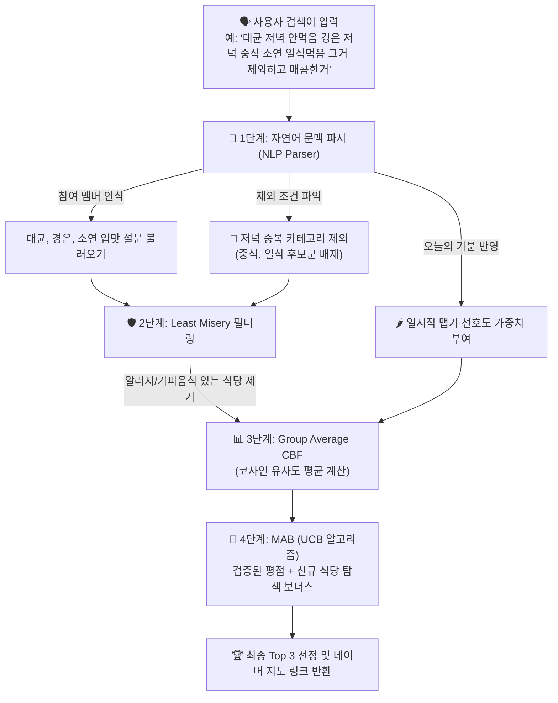

# 🍱 사내 점심 맛집 추천 AI 모델 안내서 (비(非)AI 개발자 및 동료 가이드)

> **문서 목적:** 머신러닝/AI 전공자가 아닌 백엔드 개발자 및 팀원분들이 본 서비스의 추천 로직(알고리즘)이 **왜 이렇게 설계되었고, 어떤 원리로 동작하는지** 직관적으로 이해하고 쉽게 연동할 수 있도록 안내합니다.

---

## 1. 왜 딥러닝(Deep Learning) 대신 하이브리드 알고리즘을 선택했나요?

흔히 AI 추천이라고 하면 넷플릭스나 유튜브처럼 거대한 딥러닝 모델을 떠올리기 쉽습니다. 하지만 사내 점심 추천(직원 10명 내외) 환경에는 다음과 같은 실무적 제약과 특별한 요구가 있습니다:

1. **데이터 양의 한계 (Small Data & Cold Start)**:
   - 딥러닝은 수만~수백만 건의 행동 데이터가 필요합니다. 사내 직원 10명의 데이터로는 딥러닝 모델이 학습을 하지 못하고 오답을 내는 과적합(Overfitting) 현상이 발생합니다.
2. **명확한 기피 음식과 알러지 보호 (Zero Tolerance)**:
   - "누군가 갑각류 알러지가 있거나 오이를 절대 못 먹는다"는 확률의 문제가 아닌 **100% 철저한 배제 규칙**이어야 합니다.
3. **설명 가능성 (Explainable AI)**:
   - 추천 결과를 받았을 때 *"왜 이 식당이 추천되었는지"* 명확하게 설명할 수 있어야 구성원들이 공감하고 만족합니다.

따라서 본 마이크로서비스는 **콘텐츠 기반 필터링(CBF) + 그룹 의사결정 이론(Least Misery) + 다중 팔 밴딧(MAB UCB)** 3가지 검증된 알고리즘을 결합한 **실전형 하이브리드 모델**로 구축되었습니다.

---

## 2. 알고리즘 파이프라인 전체 흐름도



---

## 3. 핵심 추천 알고리즘 3가지 쉬운 해설

### ① Least Misery (최소 불행 전략) — "단 한 명도 불행하게 하지 않기"
* **개념 설명**: 다수결로 점심을 고르다 보면 한 명이 알러지가 있거나 절대 못 먹는 음식을 억지로 먹어야 하는 비극이 생깁니다.
* **적용 방식**: 참여 멤버 중 **단 한 명이라도 알러지(`allergies`)나 기피 음식(`dislikes`)**으로 지정한 재료가 포함된 식당은 유사도가 아무리 높거나 평점이 높아도 **후보군에서 0점 처리 및 즉시 제거**합니다.

---

### ② Group Content-Based Filtering (CBF) — "우리 그룹의 교집합 입맛 찾기"
* **개념 설명**: 식당이 가진 특성(맵기 4점, 국물 있음, 고기 있음)과 직원 10명의 취향(맵기 3.5점, 국물 선호, 고기 선호)을 각각 **숫자 좌표(벡터)**로 표현합니다.
* **코사인 유사도(Cosine Similarity)**: 두 벡터 화살표의 각도가 얼마나 일치하는지를 계산하여 0점~1점 사이의 적합도를 구합니다.
* **Average Strategy (평균 전략)**: 오늘 점심에 참여하는 멤버 전원의 유사도를 평균하여, **참여자 모두에게 골고루 무난하게 맛있는 메뉴**를 점수화합니다.

---

### ③ Multi-Armed Bandit (MAB - UCB 알고리즘) — "아는 맛집 vs 새로운 맛집 발견"
* **개념 설명**: 매번 점수 높은 식당만 추천하면 매일 똑같은 김치찌개 집만 가게 됩니다(맛집 매너리즘). 이를 해결하기 위해 슬롯머신 이론인 MAB를 사용합니다.
* **UCB(Upper Confidence Bound) 공식의 두 축**:
  1. **Exploitation (활용)**: 기존 동료들이 자주 방문하고 평점(`avg_reward`)이 좋은 맛집에 기본 가산점을 줍니다.
  2. **Exploration (탐색)**: 새로 생겼거나 아직 방문 횟수(`clicks`)가 적은 식당에 **탐색 보너스 점수**를 부여하여, 주기적으로 새로운 숨은 맛집을 발굴할 수 있도록 밸런스를 맞춥니다.

---

## 4. 실전 동작 시나리오 따라가기

사용자가 웹 검색창에 다음과 같이 입력한 경우를 예로 들어봅니다:
> **입력:** *"대균 저녁 안먹음 경은 저녁 중식 소연 일식먹음 그거 제외하고 매콤한거 찾아줘"*

| 단계 | 처리 내용 | 비고 / 결과 |
|---|---|---|
| **1. 문맥 파싱** | <ul><li>참여자: **대균, 경은, 소연** 3명 식별</li><li>제외 카테고리: **중식, 일식** (저녁 중복 방지)</li><li>오늘의 기분: **매콤한 맛** 선호도 상향</li></ul> | 중식당(마라탕, 짬뽕), 일식당(라멘, 돈까스) 1차 제외 |
| **2. 알러지 필터** | 소연의 알러지(`갑각류`), 대균의 기피(`오이`) 재료가 든 식당 검사 | 해당 식당 2차 완전 제외 (Least Misery) |
| **3. 유사도 스코어링** | 남은 한식/양식 식당 중 `매콤함 + 국물/고기 선호도` 코사인 유사도 산출 | 얼큰 한돈 김치찌개, 매콤 제육볶음 등이 높은 기초 점수 획득 |
| **4. MAB 최종 보정** | 평점이 높은 검증된 집 + 최근 데이터가 부족한 신규 맛집 탐색 점수 합산 | 최종 5점 만점 환산 스코어 (`4.85점`) 및 추천 사유 생성 |

---

## 5. 백엔드 개발자 연동 요약 (Quick Reference)

백엔드 서버에서 AI 서버와 연동하는 방법은 크게 2가지입니다:

### 방법 A: 자연어 검색 API 활용 (`POST /api/search`)
사용자의 자연어 검색 문장을 그대로 전송하면, AI 서버가 설문 내역 파싱부터 네이버 지도 링크까지 전부 계산해 응답합니다.
* **요청 (Request):**
  ```json
  { "query": "대균 소연 경은 점심 식사 예정이고 매운게 땡겨" }
  ```
* **응답 (Response):**
  ```json
  {
    "participants": ["대균", "소연", "경은"],
    "context_notes": ["🌶️ 오늘의 맛 선호: 매콤/얼큰한 맛 강력 반영"],
    "recommendations": [
      {
        "rest_id": "r1",
        "name": "얼큰 한돈 생고기 김치찌개 맛집",
        "category": "한식",
        "final_score": 4.85,
        "reason": "멤버들의 맵기 및 국물/고기 선호도에 완벽히 부합하며 알러지 검증을 통과했습니다.",
        "naver_map_url": "https://map.naver.com/v5/search/%EC%96%BC%ED%81%B0%20%ED%95%9C%EB%8F%88..."
      }
    ]
  }
  ```

### 방법 B: 정형화된 추천 API 활용 (`POST /recommend`)
백엔드 DB에 저장된 `users` 배열과 네이버 지도 API 식당 `restaurants` 배열을 직접 조립해 넘길 수도 있습니다.
* **Swagger UI 바로가기:** `http://localhost:7120/docs` 접속 시 명세서 확인 및 즉시 테스트 가능합니다.
